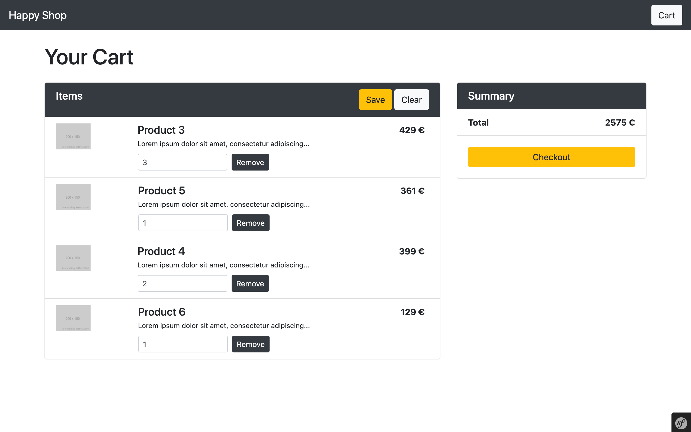

Happy Shop
==========

This repository contains all the code about the tutorial: [Building a Shopping Cart with Symfony 5](https://dev.to/qferrer/introduction-building-a-shopping-cart-with-symfony-f7h). 



The tutorial describes the creation of a shopping cart with Symfony, from scratch and step by step:

- [Getting Started](https://dev.to/qferrer/getting-started-building-a-shopping-cart-with-symfony-271e)
- [Managing Products](https://dev.to/qferrer/managing-products-building-a-shopping-cart-with-symfony-4n2)
- [Creating Cart Entities](https://dev.to/qferrer/creating-cart-entities-building-a-shopping-cart-with-symfony-h90)
- [Managing the Cart Storage](https://dev.to/qferrer/managing-the-cart-storage-building-a-shopping-cart-with-symfony-57o6)
- [Adding Products to the Cart](https://dev.to/qferrer/adding-products-to-the-cart-building-a-shopping-cart-with-symfony-103o)
- [Creating the Cart Page](https://dev.to/qferrer/creating-the-cart-page-building-a-shopping-cart-with-symfony-lcg)
- [Removing Products from the Cart](https://dev.to/qferrer/removing-products-from-the-cart-building-a-shopping-cart-with-symfony-3ebh)
- [Clearing the Cart](https://dev.to/qferrer/clearing-the-cart-building-a-shopping-cart-with-symfony-3o90)
- [Purging Expired Carts](https://dev.to/qferrer/purging-expired-carts-building-a-shopping-cart-with-symfony-3eff)
- [Testing the Cart](https://dev.to/qferrer/testing-the-cart-building-a-shopping-cart-with-symfony-476)

Requirements
------------

- PHP 7.2.5+
- [Composer](https://getcomposer.org/download)
- [Symfony CLI](https://symfony.com/download)
- [Docker & Docker compose](https://docs.docker.com/get-docker)

Getting started
---------------

**Cloning the repository**

```
$ git clone https://github.com/qferr/happy-shop
$ cd happy-shop/
```

**Installing dependencies**

```
$ composer install
```

**Starting Docker Compose**

```
$ docker-compose up -d
```

**Loading fake Products**

```
$ symfony console doctrine:fixtures:load
```

**Launching the Local Web Server**

```
$ symfony server:start -d
```

The server started on the port 8000. Open the website http://localhost:8000 in a browser.

Usage
-----

**Adding Products to the Cart**

From the [homepage](http://localhost:8000/), go to a product page by clicking on the *View details* button. Then set a quantity and click on the *Add to Cart* button.

**Removing Products from the Cart**

From the [cart page](http://localhost:8000/cart), click on the *Remove* button for the product you want to remove.

**Updating the quantity of products in the Cart**

From the [cart page](http://localhost:8000/cart), enter the desired quantity for the products and click on the *Save* button.

**Clearing the Cart**

From the [cart page](http://localhost:8000/cart), click on the *Clear* button.

**Purging Expired Carts**

From the project directory, execute the following command in a terminal:

```
$ symfony console app:remove-expired-command
```

Testing
-------

**Configuring a Database for Tests**

Create the database and update the database schema by executing the following command:
```
$ bin/console doctrine:database:create -e test
$ bin/console doctrine:migrations:migrate -e test
```

For now, the database is empty, load the products fixtures with:

```
$ bin/console doctrine:fixtures:load -e test
```

**Executing tests**

Run the tests with the following command:

```
$ bin/phpunit
```
